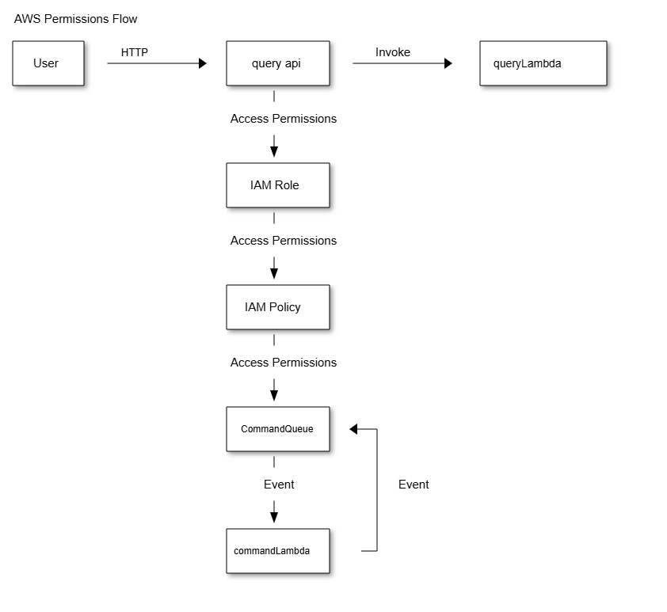

#### Fluxo Operacional

**1- Arquitetura** :

* O **API Gateway** direciona as consultas síncronas para o manipulador Lambda (`queryLambda`).
* O **SQS** recebe os comandos assíncronos e os processa com outro Lambda (`commandLambda`).
* As funções Lambda têm permissões específicas para manipular SQS e registrar logs.

**2- Fluxo** :

* **Consulta** : O cliente faz uma requisição HTTP para o API Gateway, que chama o Lambda síncrono.
* **Comando** : O cliente envia uma mensagem para o SQS, que o Lambda assíncrono consome.

### **Descrição da Arquitetura**

1. **Componentes** :

* **API Gateway** : Recebe consultas HTTP e encaminha para o Lambda síncrono.
* **Lambda Functions** :
  * `queryLambda`: Processa consultas em tempo real.
  * `commandLambda`: Processa comandos provenientes da fila SQS.
* **SQS** : Gerencia comandos assíncronos.

1. **Fluxo Operacional** :

* O cliente faz uma requisição ao API Gateway para uma consulta. O API Gateway chama diretamente o `queryLambda`.
* Para comandos, o cliente envia mensagens ao SQS. O `commandLambda` processa essas mensagens de forma assíncrona.

1. **Detalhes Técnicos** :

* As funções Lambda estão configuradas para manipular diferentes tipos de solicitações.
* A comunicação entre os componentes segue os padrões de integração da AWS, com logs sendo registrados no CloudWatch.

#### Arquitetura Final

